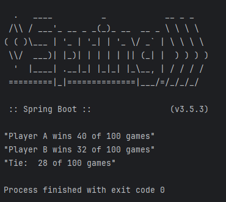

# Rock-Paper-Scissors Simulation

A Java console application that simulates 100 rounds of Rock-Paper-Scissors between two bot players. This project demonstrates clean code practices using Domain-Driven Design (DDD), robust logging, and thorough unit testing.



## Tech Stack

- **IntelliJ IDEA Community Edition** (2025.1.1.1v) IDE
- **Java** (OpenJDK 24) Main programming langguage
- **Spring Boot** (3.5.3v) Dependency injection and application framework
- **Maven** (4.0.0v) Build and dependency management
- **Lombok** (1.18.38v) Boilerplate code generation (Getters, Setters, etc.)
- **JUnit** (5.12.2v) Unit testing framework
- **Log4j2** (2.24.3v) Logging implementation
- **SLF4J** (2.0.17v) Logger facade
- **JaCoCo** (0.8.13v) Test coverage tool (99% test coverage)

## Architecture

The application follows the principles of **Domain-Driven Design (DDD)** for clear separation of concerns and maintainability.

## Main Class

The application entry point is:

```
src/main/java/com/mourat/rockpaperscissors/RockpaperscissorsApplication.java
```

## Features

✅ Simulates **100 rounds** of Rock-Paper-Scissors between two automated players  
✅ Logs game progress using two separate loggers:
- **Standard Logger**: Outputs debug, info, warn, and error messages  
- **Game Logger**: Outputs round results and final game summary into separate files located in the `logs/` directory  

✅ 99% **unit test coverage** verified with **JaCoCo**  
✅ Clean and maintainable code structure with **DDD** principles  

## How to Run

1. **Clone the repository**
    ```bash
    git clone https://github.com/machmetoglouiliaz/rock-paper-scissor
    cd rockpaperscissors
    ```

2. **Build the project**
    ```bash
    mvn clean install
    ```

3. **Run the application**
    ```bash
    mvn spring-boot:run
    ```

The app will simulate the game and generate logs in the `logs/` directory.

## Testing

Run all unit tests:
```bash
mvn test
```

JaCoCo will generate a coverage report in:
```
target/site/jacoco/index.html
```

## Logs

- Error and warning logs: `logs/error.log`  
- Info logs: `logs/info.log`
- Round and game results: `logs/rounds.log`
- Only game results: `logs/games.log`

## License

This project is licensed under the MIT License — feel free to use and modify!
